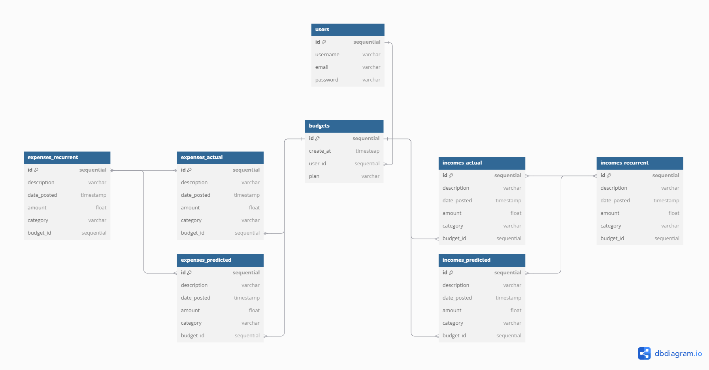

# Entity Relationship Diagram

In our database, a **User** can have multiple **Budgets**, but each **Budget** is associated with only one **User**. This is because the **Budget ID** must be unique for each user. When retrieving multiple budgets, we do so using the **User ID**. The same principle applies to **Incomes Actual** and **Incomes Predicted**. A **Budget** can have one-to-many **Incomes**, but each income must be unique to that budget, meaning an **Income Actual** can only belong to one **Budget**.

When creating a budget, we generate unique **Incomes** and unique **Predicted Incomes** as well as for **Expenses** due to the sensitivity of the data.

Additionally, **Incomes Recurrent** and **Expenses Recurrent** have a many-to-many relationship with **Incomes** and **Expenses**. These serve as placeholders when creating a budget and adding either incomes or expenses. Once created, each expense or income is unique.

## Create the List of Tables

### Users
| Column   | Type       | Notes                        |
|----------|------------|------------------------------|
| id       | sequential | primary key, increment       |
| username | varchar    |                              |
| email    | varchar    |                              |
| password | varchar    |                              |

### Budgets
| Column    | Type       | Notes                                                         |
|-----------|------------|---------------------------------------------------------------|
| id        | sequential | primary key, increment                                        |
| create_at | timestamp  |                                                               |
| user_id   | sequential | An user can have multiple budgets, but a budget can only have one user |
| plan      | varchar    | type of budget plan                                           |

### Expenses Actual
| Column       | Type       | Notes                        |
|--------------|------------|------------------------------|
| id           | sequential | primary key, increment       |
| description  | varchar    |                              |
| date_posted  | timestamp  |                              |
| amount       | float      |                              |
| category     | varchar    |                              |
| budget_id    | sequential |                              |

### Incomes Actual
| Column       | Type       | Notes                        |
|--------------|------------|------------------------------|
| id           | sequential | primary key, increment       |
| description  | varchar    |                              |
| date_posted  | timestamp  |                              |
| amount       | float      |                              |
| category     | varchar    |                              |
| budget_id    | sequential |                              |

### Expenses Predicted
| Column       | Type       | Notes                        |
|--------------|------------|------------------------------|
| id           | sequential | primary key, increment       |
| description  | varchar    |                              |
| date_posted  | timestamp  |                              |
| amount       | float      |                              |
| category     | varchar    |                              |
| budget_id    | sequential |                              |

### Incomes Predicted
| Column       | Type       | Notes                        |
|--------------|------------|------------------------------|
| id           | sequential | primary key, increment       |
| description  | varchar    |                              |
| date_posted  | timestamp  |                              |
| amount       | float      |                              |
| category     | varchar    |                              |
| budget_id    | sequential |                              |

### Incomes Recurrent
| Column       | Type       | Notes                                                      |
|--------------|------------|------------------------------------------------------------|
| id           | sequential | primary key, increment                                     |
| description  | varchar    | This are placeholders, it creates a new income from this group |
| date_posted  | timestamp  |                                                            |
| amount       | float      |                                                            |
| category     | varchar    |                                                            |
| budget_id    | sequential |                                                            |

### Expenses Recurrent
| Column       | Type       | Notes                                                      |
|--------------|------------|------------------------------------------------------------|
| id           | sequential | primary key, increment                                     |
| description  | varchar    | This are placeholders, it creates a new expense from this group |
| date_posted  | timestamp  |                                                            |
| amount       | float      |                                                            |
| category     | varchar    |                                                            |
| budget_id    | sequential |                                                            |

[👉🏾👉🏾👉🏾 List each table in your diagram]

## Add the Entity Relationship Diagram

[//]: # ([👉🏾👉🏾👉🏾 Include an image or images of the diagram below. You may also wish to use the following markdown syntax to outline each table, as per your preference.])

